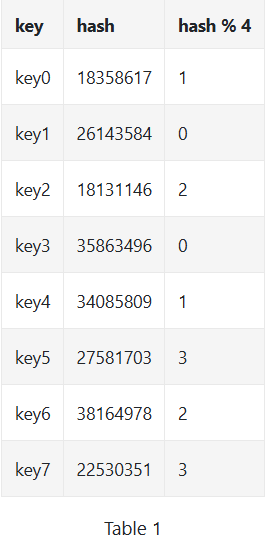
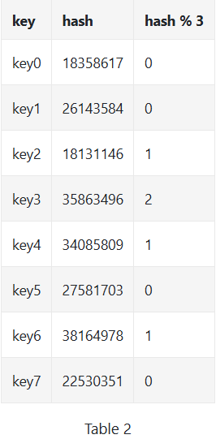
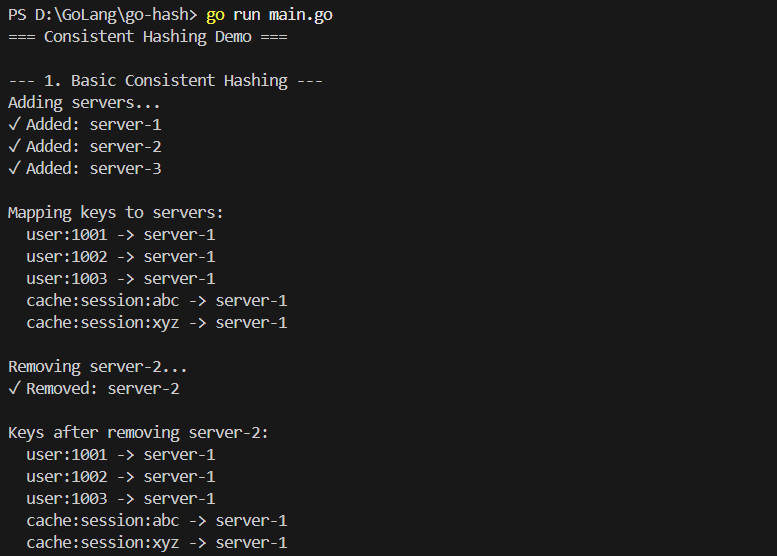
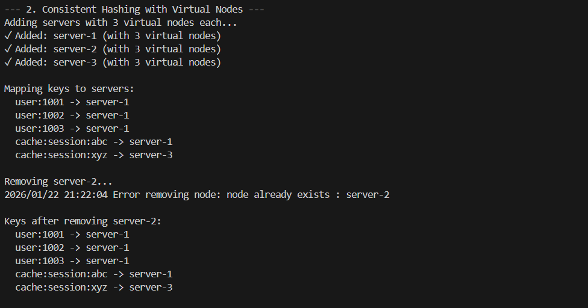
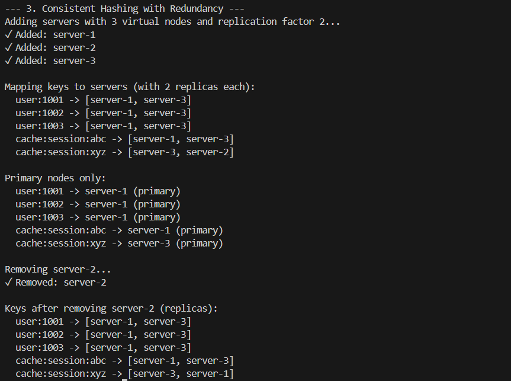

# Go Consistent Hashing Implementation

A comprehensive implementation of consistent hashing in Go, featuring three progressive approaches that address the limitations of traditional hash-based load balancing.

[](https://go.dev/)
[](LICENSE)

## 📚 Table of Contents

- [The Problem with Traditional Hashing](#the-problem-with-traditional-hashing)
- [What is Consistent Hashing?](#what-is-consistent-hashing)
- [Project Structure](#project-structure)
- [Implementation Approaches](#implementation-approaches)
  - [1. Basic Consistent Hashing](#1-basic-consistent-hashing)
  - [2. Consistent Hashing with Virtual Nodes](#2-consistent-hashing-with-virtual-nodes)
  - [3. Consistent Hashing with Redundancy](#3-consistent-hashing-with-redundancy)
- [Getting Started](#getting-started)
- [Usage Examples](#usage-examples)
- [Key Features](#key-features)
- [Real-World Applications](#real-world-applications)
- [Performance Considerations](#performance-considerations)

---

## The Problem with Traditional Hashing

Traditional hash-based load balancing uses a simple modulo operation:

```
serverIndex = hash(key) % N
```

where `N` is the number of servers.

### Why This Fails



When servers are added or removed, the modulo operation changes, causing **massive key redistribution**:


**Impact of removing one server:**



As shown above, when `server 1` goes offline and we recalculate using `hash % 3` instead of `hash % 4`, **most keys get remapped** to different servers, not just the keys from the failed server.


This causes a **cache miss storm**, overwhelming the remaining servers and potentially cascading the failure.

---

## What is Consistent Hashing?

> "Consistent hashing is a special kind of hashing such that when a hash table is resized, only **k/n keys** need to be remapped on average, where k is the number of keys, and n is the number of slots."

### The Hash Ring Concept

Instead of using modulo operation, consistent hashing maps both servers and keys onto a **circular hash space** (hash ring).


The hash space forms a ring by connecting both ends:


### How It Works

**1. Map servers onto the ring:**


**2. Map keys onto the ring:**


**3. Locate keys by going clockwise to the first server:**


### Advantages During Scaling

**Adding a server** only affects a small fraction of keys:


Only `key0` needs redistribution when `server 4` is added.

**Removing a server** also minimizes disruption:


Only `key1` needs remapping when `server 1` is removed.

---

## Project Structure

```
go-hash/
├── hashing-1/              # Basic consistent hashing
│   └── hash_ring.go
├── replication-hashing/    # With virtual nodes
│   └── hash_ring.go
├── redundant-hashing/      # With redundancy support
│   └── hash_ring.go
├── screenshots/            # Documentation images
├── main.go                 # Demo runner
├── go.mod
└── README.md
```

---

## Implementation Approaches

### 1. Basic Consistent Hashing

**Location:** `hashing-1/hash_ring.go`



#### Features
- Direct server-to-ring mapping
- Binary search for O(log n) lookups
- Thread-safe operations with RWMutex

#### The Problem It Solves
✅ Minimizes key redistribution during scaling (compared to modulo hashing)

#### Limitations It Has
❌ **Uneven load distribution** - servers can get very different amounts of data
❌ **Partition imbalance** - some servers responsible for much larger hash ranges


In this scenario, if `s1` is removed, `s2` gets double the partition size of `s0` and `s3`.


Servers can cluster together, leaving some with no data at all.

---

### 2. Consistent Hashing with Virtual Nodes

**Location:** `replication-hashing/hash_ring.go`



#### Features
- Multiple virtual nodes per physical server (default: 3)
- Better key distribution across servers
- Configurable virtual node count

#### The Problem It Solves
✅ **Solves uneven distribution** from Basic Hashing
✅ More balanced load across servers


Each server (`s0`, `s1`) is represented by multiple virtual nodes (`s0_0`, `s0_1`, `s0_2`, etc.), spreading responsibility across the ring.


Keys are mapped to virtual nodes, which reference back to physical servers.

#### How It Overcomes Basic Hashing Issues

| Issue | Basic Hashing | With Virtual Nodes |
|-------|--------------|-------------------|
| Load Distribution | Uneven, some servers get 2-3x more load | Balanced within 5-10% of mean |
| Partition Sizes | Highly variable | Uniform with 100+ virtual nodes |
| Hotspot Risk | High - servers can cluster | Low - virtual nodes spread out |

**Statistical Improvement:**
- 100 virtual nodes → ~10% standard deviation from mean
- 200 virtual nodes → ~5% standard deviation from mean

#### Limitations It Has
❌ **No redundancy** - if a server fails, data is lost
❌ **Single point of failure** for each key

---

### 3. Consistent Hashing with Redundancy

**Location:** `redundant-hashing/hash_ring.go`



#### Features
- Configurable replication factor (default: 2)
- Multiple copies of each key across different servers
- High availability and fault tolerance
- Both `GetPrimaryNode()` and `GetNodesForKey()` methods

#### The Problem It Solves
✅ **Adds fault tolerance** missing from previous implementations
✅ **Data redundancy** - keys survive server failures
✅ **High availability** - read from any replica

#### How It Overcomes Previous Issues

| Issue | Previous Solutions | With Redundancy |
|-------|-------------------|-----------------|
| Data Loss on Failure | Data lost if server dies | Data replicated across N servers |
| Single Point of Failure | Each key depends on one server | Multiple servers have each key |
| Read Scalability | Limited to one server | Can read from any replica |

#### Affected Range on Server Changes

**When adding a server:**


Keys between `s3` and `s4` are affected and redistributed.

**When removing a server:**


Keys between `s0` and `s1` need redistribution to maintain replication factor.

#### Use Cases
- **Distributed caches** (Redis Cluster, Memcached)
- **Distributed databases** (Cassandra, DynamoDB)
- **Content delivery networks** (Akamai)
- **Load balancers** (Maglev)

---

## Getting Started

### Prerequisites

```bash
go version  # Should be 1.18 or higher
```

### Installation

```bash
git clone https://github.com/Tanishq4501/go-hash.git
cd go-hash
```

### Run Demo

```bash
go run main.go
```

Expected output:
```
=== Consistent Hashing Demo ===

--- 1. Basic Consistent Hashing ---
Adding servers...
✓ Added: server-1
✓ Added: server-2
✓ Added: server-3

Mapping keys to servers:
  user:1001 -> server-2
  user:1002 -> server-1
  user:1003 -> server-3
  cache:session:abc -> server-1
  cache:session:xyz -> server-3
...
```

---

## Usage Examples

### Basic Consistent Hashing

```go
import hashing1 "github.com/Tanishq4501/go-hash/hashing-1"

// Create hash ring
ring := hashing1.InitHashRing(
    hashing1.EnableVerboseLogs(true),
)

// Add servers
ring.AddServer(&CacheNode{ID: "server-1"})
ring.AddServer(&CacheNode{ID: "server-2"})

// Get server for key
node, err := ring.GetServer("user:1001")
if err != nil {
    log.Fatal(err)
}
fmt.Printf("Key stored on: %s\n", node.GetIdentifier())

// Remove server
ring.RemoveServer(&CacheNode{ID: "server-1"})
```

### Consistent Hashing with Virtual Nodes

```go
import replicationhashing "github.com/Tanishq4501/go-hash/replication-hashing"

// Create ring with virtual nodes
ring := replicationhashing.InitHashRing(
    replicationhashing.SetVirtualNodes(150),  // More = better distribution
    replicationhashing.EnableVerboseLogs(false),
)

// Use same API as basic hashing
ring.AddServer(&CacheNode{ID: "server-1"})
node, _ := ring.GetServer("user:1001")
```

### Consistent Hashing with Redundancy

```go
import redundanthashing "github.com/Tanishq4501/go-hash/redundant-hashing"

// Create ring with redundancy
ring := redundanthashing.InitHashRing(
    redundanthashing.SetVirtualNodes(100),
    redundanthashing.SetReplicationFactor(3),  // 3 copies of each key
    redundanthashing.EnableVerboseLogs(false),
)

ring.AddNode(&CacheNode{ID: "server-1"})
ring.AddNode(&CacheNode{ID: "server-2"})
ring.AddNode(&CacheNode{ID: "server-3"})

// Get all replicas for a key
nodes, err := ring.GetNodesForKey("user:1001")
if err != nil {
    log.Fatal(err)
}
fmt.Printf("Key replicated on: %v\n", nodes)

// Or get just the primary node
primary, _ := ring.GetPrimaryNode("user:1001")
fmt.Printf("Primary node: %s\n", primary.GetIdentifier())
```

### Custom Hash Function

```go
import "hash/fnv"

ring := redundanthashing.InitHashRing(
    redundanthashing.SetHashFunction(fnv.New64a),
    redundanthashing.SetVirtualNodes(200),
)
```

### Implementing ICacheNode Interface

```go
type CacheNode struct {
    ID   string
    Host string
    Port int
}

func (n *CacheNode) GetIdentifier() string {
    return n.ID
}

// Now use it with any hash ring
node := &CacheNode{
    ID:   "cache-01",
    Host: "192.168.1.100",
    Port: 6379,
}
ring.AddNode(node)
```

---

## Key Features

### Thread Safety
All implementations use `sync.RWMutex` for concurrent access:
- Multiple readers can access simultaneously
- Writers get exclusive access
- Safe for use in multi-threaded applications

### Performance
- **O(log n)** key lookup using binary search
- **O(n)** server addition/removal (where n = number of virtual nodes)
- Minimal memory overhead with `sync.Map`

### Configurability
- Custom hash functions (SHA-1, FNV, CRC32, etc.)
- Adjustable virtual nodes (trade-off: distribution vs. memory)
- Configurable replication factor
- Optional verbose logging for debugging

### Error Handling
Comprehensive error types:
- `ErrNoNodesAvailable` / `ErrNoConnectedNodes`
- `ErrNodeExists`
- `ErrNodeNotFound`
- `ErrHashingKey` / `ErrInHashingKey`

---

## Real-World Applications

Consistent hashing is used in production by:

| System | Use Case |
|--------|----------|
| **Amazon DynamoDB** | Partitioning component of distributed database |
| **Apache Cassandra** | Data partitioning across cluster nodes |
| **Discord** | Chat message distribution and load balancing |
| **Akamai CDN** | Content distribution to edge servers |
| **Maglev** | Google's network load balancer |
| **Redis Cluster** | Sharding data across cluster nodes |
| **Memcached** | Distributed caching layer |

---

## Performance Considerations

### Virtual Nodes Trade-off

```go
// Fewer virtual nodes = faster, but less balanced
ring := InitHashRing(SetVirtualNodes(10))    // Fast, uneven distribution

// More virtual nodes = slower, but well balanced  
ring := InitHashRing(SetVirtualNodes(500))   // Slower, even distribution

// Sweet spot for most applications
ring := InitHashRing(SetVirtualNodes(150))   // Balanced
```

### Memory Usage

| Implementation | Memory per Server |
|---------------|------------------|
| Basic Hashing | 1 hash entry |
| Virtual Nodes (n=100) | 100 hash entries |
| Virtual Nodes (n=500) | 500 hash entries |

### Replication Factor Impact

Higher replication:
- ✅ Better fault tolerance
- ✅ Higher read throughput (read from any replica)
- ❌ More storage required (N copies of data)
- ❌ More network overhead on writes

---

## Benefits of Consistent Hashing

✅ **Minimal redistribution** - Only k/n keys remapped when servers change  
✅ **Horizontal scalability** - Easy to add/remove servers  
✅ **Hotspot mitigation** - Even distribution prevents overload  
✅ **Fault tolerance** - System continues operating when servers fail  
✅ **Predictable** - Same key always maps to same servers

---

## Contributing

Contributions are welcome! Please feel free to submit a Pull Request.

1. Fork the repository
2. Create your feature branch (`git checkout -b feature/AmazingFeature`)
3. Commit your changes (`git commit -m 'Add some AmazingFeature'`)
4. Push to the branch (`git push origin feature/AmazingFeature`)
5. Open a Pull Request

---

## License

This project is licensed under the MIT License - see the [LICENSE](LICENSE) file for details.

---

## References

1. Karger, D., et al. "Consistent Hashing and Random Trees" (MIT, 1997)
2. "Consistent Hashing: Algorithmic Tradeoffs" - Research on virtual node distribution
3. DeCandia, G., et al. "Dynamo: Amazon's Highly Available Key-value Store" (2007)
4. Lakshman, A., Malik, P. "Cassandra: A Decentralized Structured Storage System" (2010)

---

## Author

**Tanishq4501**

- GitHub: [@Tanishq4501](https://github.com/Tanishq4501)

---

<p align="center">
  <i>Built with ❤️ using Go</i>
</p>
